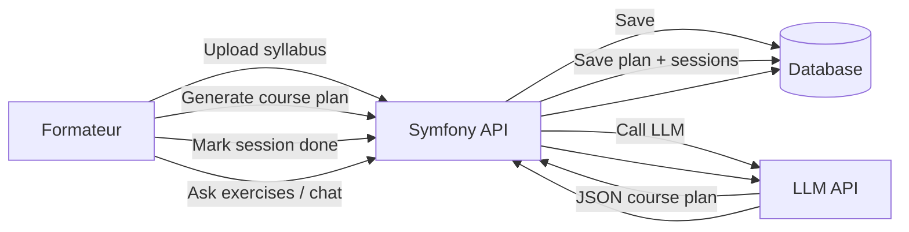

## 1. Schéma d’architecture (vue globale)

### 1.1. Composants

* **Client**

  * (MVP) : Swagger UI / Postman / simple front (facultatif)
* **Backend**

  * Symfony 7
  * API Platform
  * LexikJWTAuthenticationBundle (ou autre) pour auth
  * VichUploader (optionnel) pour l’upload de PDF
* **Service IA externe**

  * API de LLM (OpenAI, Mistral, LM Studio, etc.)
  * Communication via HTTP (JSON)

### 1.2. Flux principaux

```text
[Formateur] 
   ↓ (1. Upload / POST syllabus)
[API Symfony / API Platform]
   ↓ (2. Sauvegarde en DB)
[DB Syllabus]

[Formateur] 
   ↓ (3. Demande génération plan de cours / POST /ai/generate-course-plan)
[API Symfony]
   ↓ (4. Appel HTTP)
[API LLM externe]
   ↓ (5. JSON structuré plan de cours)
[API Symfony]
   ↓ (6. Création CoursePlan + Sessions en DB)
[DB CoursePlan + Session]

[Formateur]
   ↓ (7. PATCH /sessions/{id}/complete + notes_reelles)
[DB Session]

[Formateur] 
   ↓ (8. POST /ai/generate-exercises, /ai/chat, etc.)
[API Symfony] ↔ [API LLM externe]
```


---
